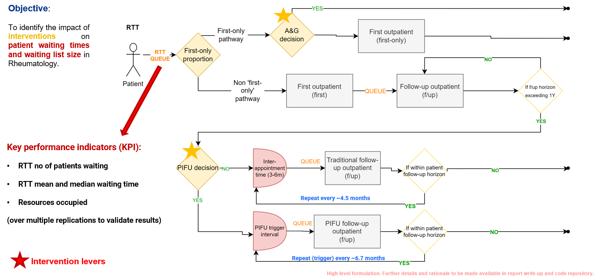
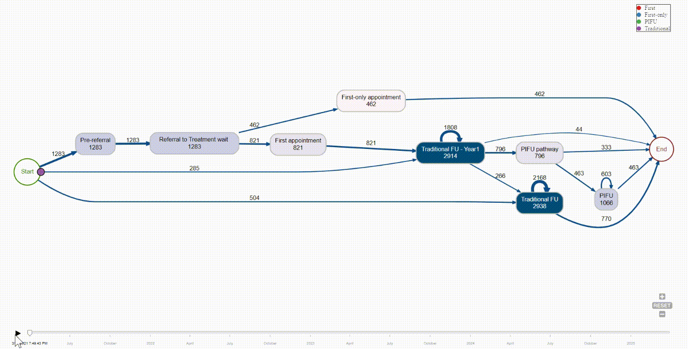
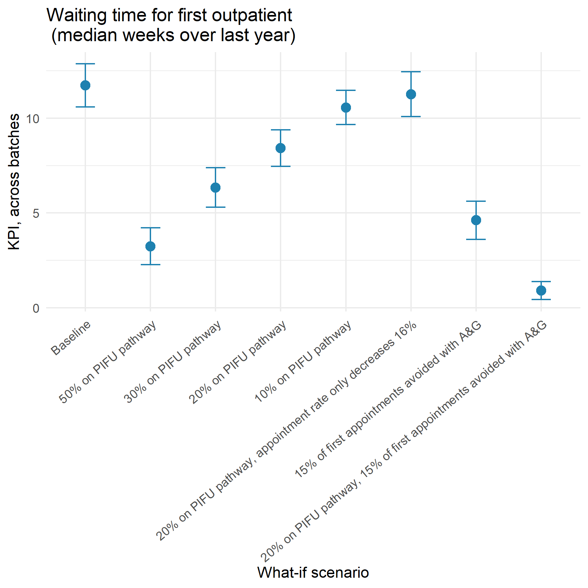
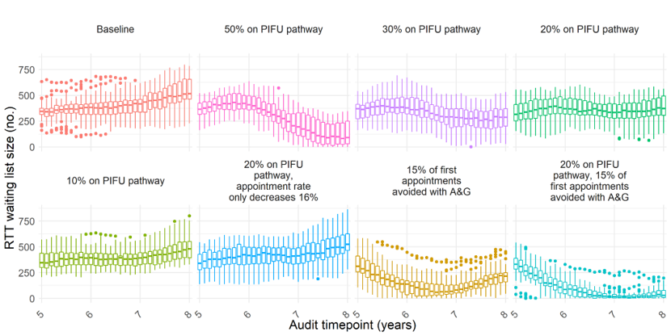

## Context 

The pandemic has had a considerable impact on elective care and currently, the waiting list is at its highest on record, with over 6.6 million people waiting for consultant-led elective care [1]. It is estimated that around 6M fewer people completed elective pathways between January 2020 and July 2021 [2]. Operational performance, defined by the proportion of those seen within 18 weeks (target of 92%) has dropped significantly. The proportion seen within 18 weeks has dropped to below 65%[1].

Patient Initiated Follow Up (PIFU) is one of the main tools in the Recovery Plan, alongside other digital solutions such as advice & guidance (A&G) e-referrals.

Advice and guidance allows a clinician to seek advice from another. This may in certain instances mean avoiding an unnecessary GP referral, while seeking advice and guidance from the consultant.

PIFU is where, based on clinical steer, a patient goes on a pathway where they can arrange their own follow-up appointments as-and-when-needed rather than attending regular scheduled appointments. It means for instance that time spent on low clinical value appointments can be repurposed for managing complex patients and upstream care. The interplay between the downstream efficiencies and the upstream referral-to-treatment waiting list, as well as changes to planned levels of resourcing and allocation, can however be hard to grasp.

As such, in this project we propose to use Discrete Event Simulation - where individual patients’ pathway movement through a system with constrained resources is simulated and monitored - to better understand the role that PIFU and other interventions can play in addressing the elective (referral-to-treatment) backlog and supporting patient care.

## Project objectives
*	Use Discrete Event Simulation to better understand the role patient initiated follow-up (PIFU) can play in addressing the (outpatient and elective) referral-to-treatment (RTT) backlog, with particular emphasis on Rheumatology
*	Advocate and demonstrate the value of pathway and behavioural modelling in central and Integrated Care System decision-making for digital pathway redesign, elective recovery and the Long-Term Plan personalisation agenda and Public Health Management Agenda, to support better patient care, experience and system resilience

We focussed on rheumatology given that rheumatology has a good clinical evidence base on PIFU [5-10]; documented pathways [3,7]; PIFU is actively endorsed [3,4,7]; and that it is a mainly outpatient specialty with many chronic patients on long-term follow-up, meaning that the effect of PIFU may be amplified [3].

## Main model

Can be run from `simpy_rheum_v004_run.py` in Python (spyder, VS Code). The main `simpy` model implementation is in `simpy_rheum_v004.py`. 

An overview of the simplified pathway / process map, as employed in the DES `simpy` model, is shown below.

An intuition of the flow (with changed parameters to improve intuitiveness and clarity of visualisation), is given in the animated process map flow below.

## Illustrative use case ("V3"), a stylistic trust

As an example of the model in operation, we aimed to create a hypothetical baseline case for a fictitious trust with realistic parameters and assumptions.

### Illustrative use case ("V3") - parameters

We obtained parameter inputs from GIRFT guidance, NHS Digital, clinical data and publications to build a hypothetical baseline case for a fictitious trust with realistic parameters and assumptions, including reasonable resulting waiting list characteristics.

We then applied what-if modelling to this baseline case based on PIFU or A&G interventions.

Some details of parameters for the use case, both the baseline and what-if, can be found below (for full details within script and - upon request - via project report).

### Illustrative use case ("V3") - outputs

Some outputs are shown below:

nb: `simpy` output logs themselves not uploaded to repo due to size. Can be regenerated with the code given (the current parameters are set to match scenario A above, for the use case "V3"). The plots were created upon post-processing of `simpy` logs of appointments and patients across simulated scenarios, with R script `80-postprocessing_plots.R`.

## Toy tool

A toy interactive app leveraging streamlit is being worked on (to be updated with host location).
In the meantime, the script can be found here `streamlit_model_mf_v0031_batch.py` for local machine deployment (see [here](https://www.youtube.com/watch?v=_PPUk__mXLI) for guidance)

### References

[1] NHS England, “Consultant-led Referral to Treatment Waiting Times,” NHS, 2022. https://www.england.nhs.uk/statistics/statistical-work-areas/rtt-waiting-times/ (accessed Aug. 22, 2022).

[2] Health Foundation, "Elective care: how has COVID-19 affected the waiting list?", https://www.health.org.uk/news-and-comment/charts-and-infographics/elective-care-how-has-covid-19-affected-the-waiting-list#:~:text=Between%20January%202020%20and%20July%202021%2C%20more%20than%206%20million,2021%20(January%20to%20July) (accessed December 2021)

[3] A. Macgregor, L. Kay, and P. Lanyon, “Rheumatology GIRFT Programme National Specialty Report,” 2021. 

[4]	NHS England, “Delivery plan for tackling the COVID-19 backlog of elective care,” 2022. 

[5]	R. Panduro Poggenborg, O. R. Madsen, L. Dreyer, G. Bukh, and A. Hansen, “Patient-controlled outpatient follow-up on demand for patients with rheumatoid arthritis: a 2-year randomized controlled trial,” # International League of Associations for Rheumatology, p. 2021, doi: 10.1007/s10067-021-05674-y/Published. 

[6]	S. Hewlett et al., “Patient initiated outpatient follow up in rheumatoid arthritis: Six year randomised controlled trial,” Br Med J, vol. 330, no. 7484, pp. 171–175, Jan. 2005, doi: 10.1136/bmj.38265.493773.8F. 

[7]	NHS England, “Implementing patient-initiated follow-up (PIFU) in adult rheumatology services,” 2022. 

[8]	S. Child, V. A. Goodwin, M. G. Perry, C. A. Gericke, and R. Byng, “Implementing a patient-initiated review system in rheumatoid arthritis: A qualitative evaluation,” BMC Health Serv Res, vol. 15, no. 1, Apr. 2015, doi: 10.1186/s12913-015-0837-9. 

[9]	R. Whear, A. K. Abdul-Rahman, K. Boddy, J. Thompson-Coon, M. Perry, and K. Stein, “The Clinical Effectiveness of Patient Initiated Clinics for Patients with Chronic or Recurrent Conditions Managed in Secondary Care: A Systematic Review,” PLoS One, vol. 8, no. 10, Oct. 2013, doi: 10.1371/journal.pone.0074774. 

[10]	R. Whear et al., “Patient-initiated appointment systems for adults with chronic conditions in secondary care,” Cochrane Database of Systematic Reviews, vol. 2020, no. 4. John Wiley and Sons Ltd, Apr. 09, 2020. doi: 10.1002/14651858.CD010763.pub2. 
  
